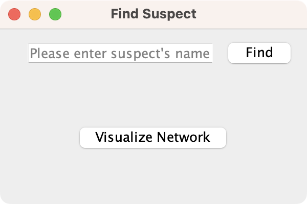
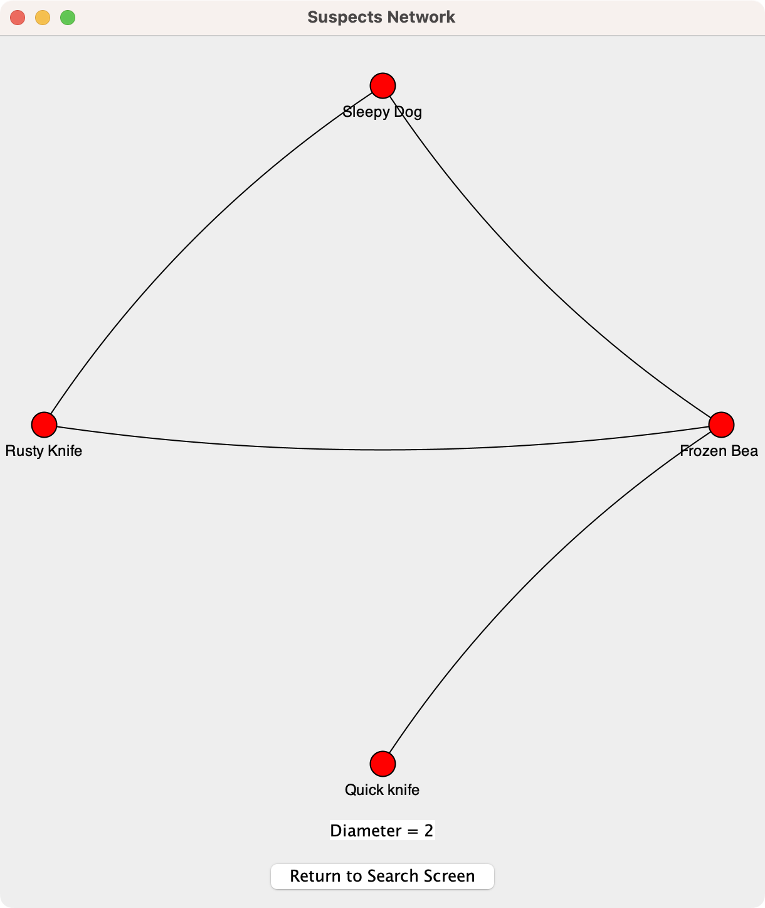

# surveillance-net

A Java Swing Application for a hypothetical surveillance network with a micro framework inspired by Flutter Framework.

## 📸 Screenshots

<table>
  <tr>
    <td>Home Page</td>
     <td>Suspect Page</td>
     <td>Network Page</td>
  </tr>
  <tr>
    <td></td>
    <td></td>
    <td></td>
  </tr>
 </table>
