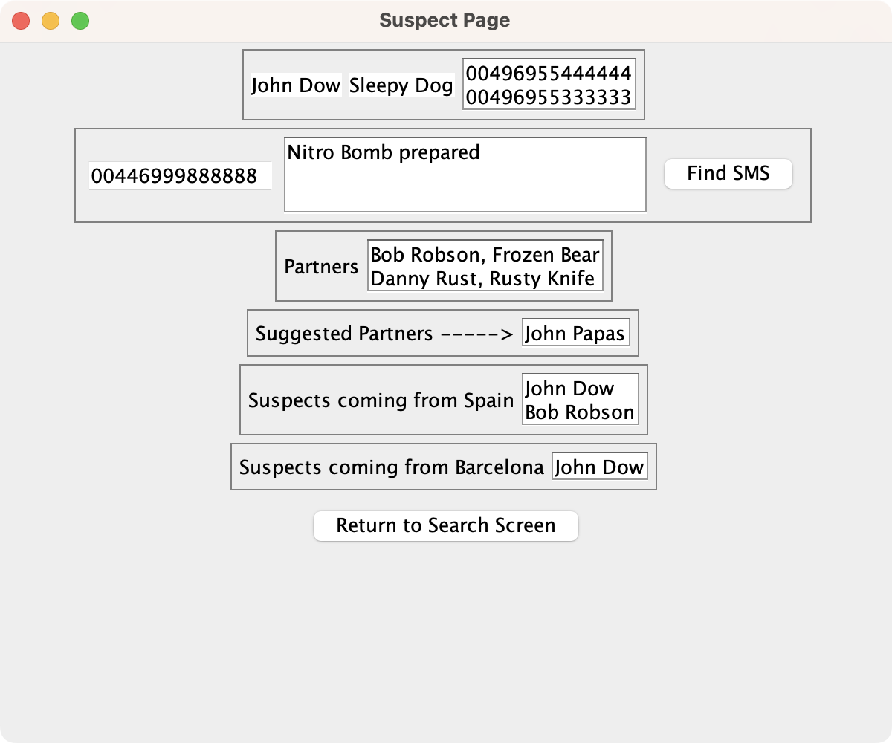

# surveillance-net

Cross-platform desktop application for a hypothetical surveillance network, built using Java Swing.

## 🏛️ Architecture

### `/models`

This is where the business logic of the application lies.

### `/pages`

The pages of the application, **HomePage**, **SuspectPage** and **NetworkPage**. Pages get their own id and can later be added to the router.

### `/utility`

Utility classes like **Router** and **Database** alongside other helper components for Java Swing, like **TextPrompt** and **SizedBox**.

### `/widgets`

The widgets of the application live here. Widgets are reusable blocks of code that get access to the database and the mechanism for building and updating their content. Widgets can also be embedded into other widgets or pages accordingly.

## 📸 Screenshots

<table>
  <tr>
    <td>Home Page</td>
     <td>Suspect Page</td>
     <td>Network Page</td>
  </tr>
  <tr>
    <td></td>
    <td></td>
    <td></td>
  </tr>
 </table>
